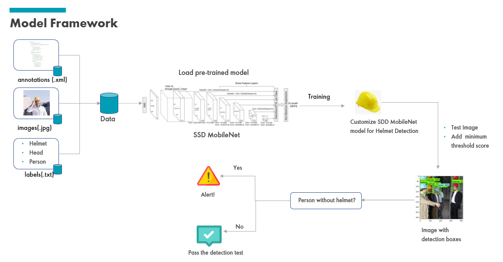
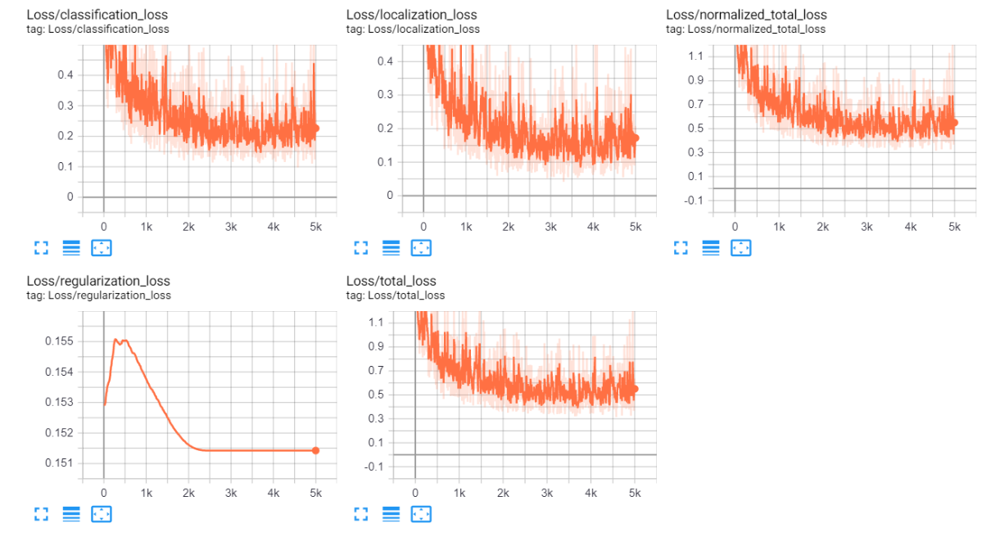
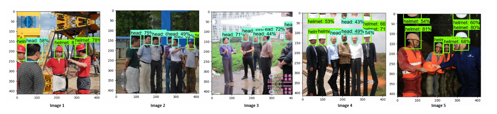
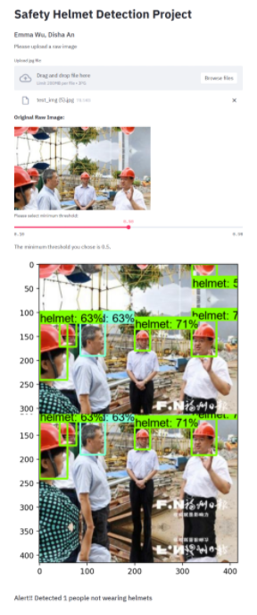

# safety-helmet-detection
Detect if people in pictures on construction sites are wearing safety helmets

## Introduction
Safety helmet is critical to all workers and visitors on construction sites. According to statistics online, between 2003 to 2010, over 2,200 construction workers died of a traumatic brain injury, and over 80% of brain injury were due to safety helmet. Brain injury can be not only physically dangerous, but also economically expensive to afford as well. The treatment costs over $100k for mild brain injury, $941,000 for moderate injury, up to $3 million for severe injury. 

To avoid any accident caused by lack of helmets on construction sites, this project designed a safety helmet detection algorithm, which automatically detects how many people in a given picture are not wearing helmets, and uses bounding box to identify their position in the picture. With this algorithm, we can alert people on sites who have not put their helmets on, alert supervisors who are monitoring the sites real-time, and thus provide a safer workspace for all workers and visitors on site.

## Data Summary
The dataset for this project is collected from [Kaggle](https://www.kaggle.com/andrewmvd/hard-hat-detection). This dataset contains 5000 sample images for people with and without safety helmets in the following files:

1. raw images in`*.png` format
2. the respective PASCAL VOC format annotations files with bounding boxes in `*.xml` format
3. 3-class labels: Helmet, Person, and Head

Among these 5000 images, we used 80% as training set and 20% as test set, i.e. 4000 images for model training and 1000 images for evaluation.

## Workflow

## Model Training and Performance

For this project, we adopted the idea of transfer learning and used pretrained model from Tensorflow 2 Detection Model Zoo. We experimented on a few models, including EfficientNet, SSD MobileNet V1, SSD RetinaNet50, Faster R-CNN InceptionNet50 and Faster R-CNN ResNet50. Considering the trade-off between model performance and the training speed, we decided on SSD MobileNet as our final solution.

The `mobilenet-ssd` model is a Single-Shot multibox Detection (SSD) network intended to perform object detection. This model is implemented using the Caffe framework. On our test set, the final loss is close to 0.2 to 0.3, and the details in the Tensor board screenshot below.

Once the model is trained and selected, we have tested on several images from test dataset. The algorithm successfully detected heads and helmets with high confidence score, as the example images shows below.

The final solution is designed as an interactive website. Users can upload the a image they want to test, adjust the minimum detection score threshold (from 0 to 1), and get the detection result as a new image with bounding boxes. If any people are detected not wearing helmets, an alert will be printed out at the bottom indicating the number of people not wearing helmets. If none are found, the web will print out "pass detection test". See the example below.

## Challenges

Although the detection result is quite satisfying in general, there are several aspects that could be improved further:

1. In order to keep all images as the same size, some pre-processing methods has been adopted to expand image size, such as mirroring and twirling. Therefore we might see some examples with helmets and head on the top of images, for example, Image 3 and Image 4 in the result examples above. The algorithm will detect these heads and helmets as well, which is expected. But since these mirrored heads and helmets are not complete, the algorithm will have lower confidence score and make more mistakes.
2. The current algorithm detects better with people closer to the camera, but when people are too far away, the algorithm finds it harder to detect, such as the worker in the background in Image 1 in result examples above. Considering the dataset we have with such sample images are not enough and not completely well-labeled, we could further improve our detection algorithm given more samples with smaller people. More computation power to support more complex models with better performance will also help tremendously.
3. Due to the restriction of available resources, we are running the algorithm completely on our local machines, which means the computation power is very limited. Although some models will potentially have better performance, we have abandoned those to get faster training and detection. With more computation power from better machines or high-compacity cloud service, we might be able to find even more accurate and sensitive detection algorithms.

## File Structure

This repo contains the following folders:

* `scripts`: this folder contains scripts for pre-processing dataset before feeding into model

* `workspace`: this is the main workspace to store dataset, trained models, and test results

  * `annotations`: This folder will be used to store the label map in `*.pbtxt` format and the TensorFlow `*.record` files converted from annotations files (not generated yet in this repo)

  * `exported-models`: This folder will be used to store exported versions of our trained model(s).

  * `data`: This folder contains a copy of all the images in our dataset, as well as the respective `*.xml` files produced for each one, once `labelImg` is used to annotate objects.

    > - `data/annotations`: This folder contains a copy of PASCAL VOC annotations files in `*.xml` format, which will be used to label the images and generate Tensorflow record format for model training
    > - `data/images`: This folder contains a copy of images in `*.jpg` format, which will be used to test our model.

  * `models`: This folder will contain a sub-folder for each of training job. Each subfolder will contain the training pipeline configuration file `*.config`, as well as all files generated during the training and evaluation of our model.

  * `pre-trained-models`: This folder will contain the downloaded pre-trained models, which shall be used as a starting checkpoint for our training jobs.

## Reference
1. [TensorFlow 2 Object Detection API tutorial](https://tensorflow-object-detection-api-tutorial.readthedocs.io/en/latest/index.html)
2. [TensorFlow 2 Detection Model Zoo](https://github.com/tensorflow/models/blob/master/research/object_detection/g3doc/tf2_detection_zoo.md)
3. [mobilenet-ssd](https://docs.openvinotoolkit.org/latest/omz_models_public_mobilenet_ssd_mobilenet_ssd.html)

